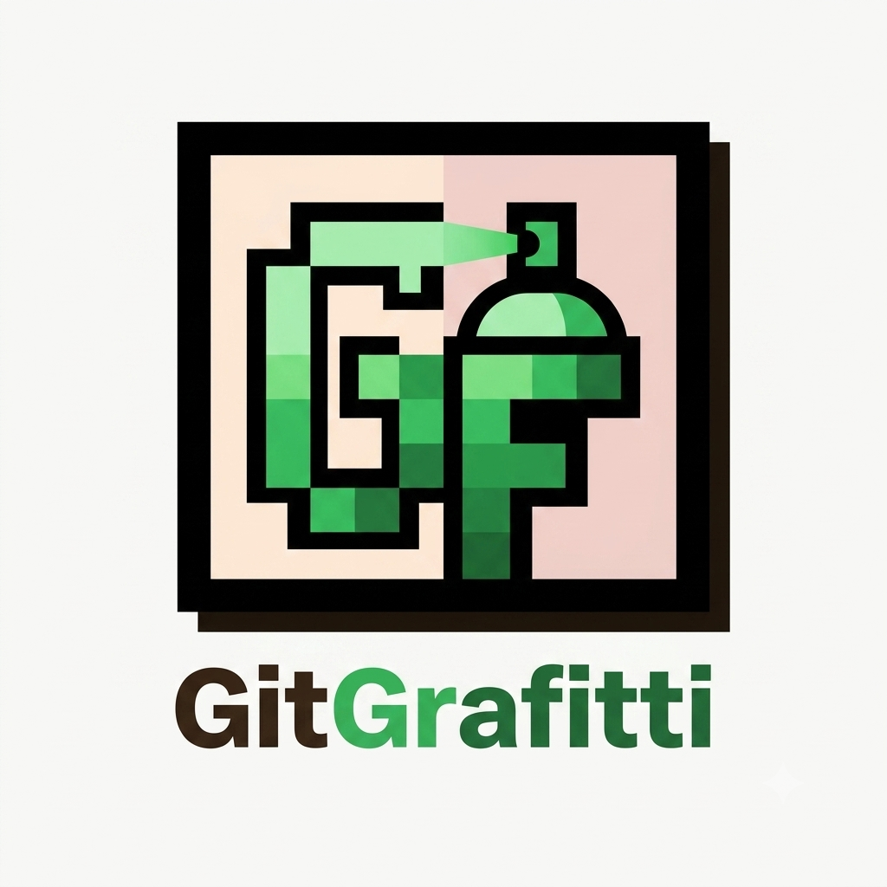

# GitGrafitti



> Turn your GitHub contribution graph into a canvas for pixel art.

GitGrafitti is a visual tool that lets you draw custom patterns across any year on a contribution heatmap, pick your shades of GitHub green, and instantly generate a single Bash script that paints your GitHub profile.


## Why GitGrafitti?

Let us be honest: staring at a half-empty contribution graph can feel a bit dull. Whether you want to spell out your name, draw an 8-bit invader, or just give your profile a bit of personality, GitGrafitti makes it trivial.

No complex terminal setups, no manual environment configurations. Just draw, generate, copy, paste, and push.


## Features

* **Interactive Heatmap Drawing Canvas:** Click and drag to paint pixels just like a desktop drawing app.
* **Exact GitHub Color Accuracy:** Supports four distinct levels of GitHub green, automatically calculated and scaled to trigger the right shade on your profile grid.
* **Year & Grid Alignment:** Dynamically adjusts the start day of the week for any selected year so your design hits the exact dates intended.
* **Automatic Local Timezone Detection:** Keeps your backdated commits strictly aligned with your actual time zone to prevent awkward midnight date-shifting.
* **Built-In Guided Tour:** Includes an interactive walkthrough and a step-by-step beginner guide for anyone new to Git or GitHub.
* **Neo-Brutalist Interface:** Designed with bold borders, hard drop shadows, and full dark mode support.


## How The Magic Works

Git allows commit metadata to include custom timestamp variables. GitGrafitti leverages `GIT_AUTHOR_DATE` and `GIT_COMMITTER_DATE` to backdate empty commits.

```bash
GIT_AUTHOR_DATE="2026-05-12 12:00:00 +0400" GIT_COMMITTER_DATE="2026-05-12 12:00:00 +0400" git commit --allow-empty -m "Art commit"
```
Because GitHub calculates your graph's green shades based on relative daily commit counts, GitGrafitti automatically calculates how many commits are required for each pixel level (from 1 commit for dark green up to 12 commits for bright green) and loops them into a single script.

## Quickstart Guide
1. Create a Fresh Repository on GitHub
* Go to GitHub and create a new repository (for example, gitgrafitti-art).
* Make sure to NOT select initialize with a README (the repository must start completely empty).
2. Set Up Your Local Folder
* Open your terminal (or Git Bash on Windows) and run:
```bash
mkdir gitgrafitti-art
cd gitgrafitti-art
git init
```

3. Draw and Generate
* Open the GitGrafitti web interface.
* Select your target Year and pick an Ink Shade.
* Click and drag across the grid to create your design.
* Select your Timezone and click Generate Git Commands.
* Click Copy to grab the generated Bash script.

4. Run & Push
* Paste the code into your terminal and press Enter. Once the script finishes making the empty backdated commits, link your repository and push:
```bash
git remote add origin https://github.com/YOUR_USERNAME/gitgrafitti-art.git
git push -u origin main
```
* Refresh your GitHub profile to see your new contribution art.

### Cleaning Up / Resetting Your Graph
If you ever want to clear your graph and remove the artwork:
* Delete the gitgrafitti-art repository from your GitHub settings page.
* The backdated activity will vanish from your profile graph automatically within a few minutes.

## Tech Stack
* Frontend: Vanilla HTML5, CSS3, JavaScript (ES6+)
* Typography: Urbanist (Headings) and Fira Code (Monospace text)

## License
Distributed under the MIT License. Feel free to fork, adapt, and build upon it!
